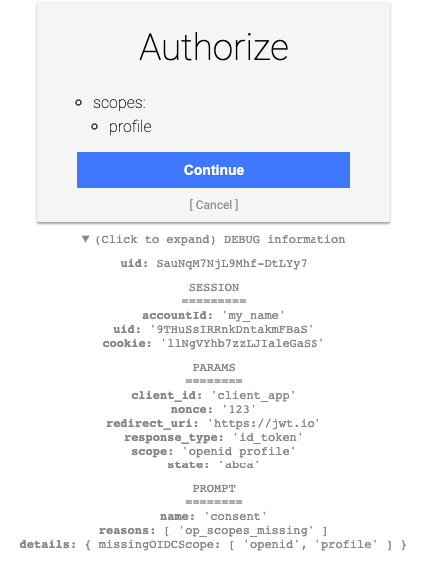

# Open Banking Brazil - Authentication Samples

# Overview

This repo intends to demonstrate how an environment with the Open Banking mock API's can work in AWS using mTLS.
*** 

# Prerequisites:

- [awscli](https://docs.aws.amazon.com/cli/latest/userguide/cli-chap-install.html)
- [Pre configured AWS credentials](https://docs.aws.amazon.com/amazonswf/latest/developerguide/RubyFlowOptions.html)
- [npm](https://docs.npmjs.com/downloading-and-installing-node-js-and-npm)
- [cdk](https://docs.aws.amazon.com/cdk/latest/guide/getting_started.html)
- [Docker](https://docs.docker.com/get-docker/)

## How to deploy

Make sure Docker is running. During the deploy we will use Docker to create the container that will be used to run NGINX. 

After Docker is running, execute the following commands: 

```
git clone <REPO_URL>

cd <REPO_NAME>/

./proxy/generate-certs.sh

npm install

cdk bootstrap

cdk synth

cdk deploy
```

This will clone this repo, then install all packages required. CDK will then bootstrap a deploy environment in your account. You will then synthetize a cloudformation template and finally deploy it. The end result will be the following architecture: 


# How to test

There are two options for tests:

- Postman
- Terminal

Before moving on, make sure you have in hand the your Network Load Balancer (NLB) URL. CDK shows you an output with the created assets and you should look for a name similar to "OpenBankingBrazil.ProxyProxyServiceLoadBalancerDNSE4FAFBA0". Copy the value of this key as it is the URL for your NLB.

## Postman

Follow these steps to prepare your setup: 

- [Create Workspace](https://learning.postman.com/docs/collaborating-in-postman/using-workspaces/creating-workspaces/)

- [Create Environment](https://learning.postman.com/docs/sending-requests/variables/)

Set the following env variables in the `.env` file:

| Key   |      Value      |      Description      |
|----------|:-------------:|-----------------------:|
| ECR_REPOSITORY_ARN | arn:aws:ecr:<region>:<account_id>:repository/node-oidc-provider | Your Amazon ECR repository name for the Node OIDC Provider application |
| ECR_OIDC_IMAGE_TAG | latest | Your Docker image tag (e.g. latest) |
| ACM_CERTIFICATE_ARN |  arn:aws:acm:<region>:<account_id>:certificate/abc-123 | Your Amazon Certificate Manager (ACM) public certificate ARN |
| R53_ZONE_NAME | example.com | Your Route 53 public zone name (e.g. example.com) |
| R53_HOSTED_ZONE_ID | ABCDEF012345 | Your Route 53 public Hosted Zone ID |
| R53_DOMAIN_NAME | oidc.example.com | The desired domain name to host your OIDC application (e.g. oidc.example.com) |
| JWKS_URI | /jwks | Your OIDC Provider's JWKS Endpoint |
| SM_JWKS_SECRET_NAME | dev/OpenBankingBrazil/Auth/OIDC_JWKS | The AWS Secrets Manager's secret name to securely store your JWKS Key ID for JWT token verification |


## Test Your Application 

### 1. Terminal - Invoke your API
First, use terminal to run the following command to invoke your API without any JWT token:

```sh
curl -X GET https://<API-ID>.execute-api.<REGION>.amazonaws.com/prod/
```
You should get the following error message with a `401 HTTP Status Code`:

`"message": "Unauthorized"`

Or the following error message with a `403 HTTP Status Code` in case you pass an invalid `Bearer` token:

`"Message": "User is not authorized to access this resource with an explicit deny"`

### 2. Browser - Authenticate against the OIDC provider

Open your browser and open the following URL:

`https://<YOUR-DOMAIN-NAME>/auth?client_id=client_app&redirect_uri=https://jwt.io&response_type=id_token&scope=openid%20profile&nonce=123&state=abca`

You'll be required to enter your username/password. At this time, you can enter any user/pass. Click **Sign-in**.


Now, once presented with the `consent` screen, you can authorize the provider to issue a token on behalf of your user. Click **Continue**.



For validation-only purposes, you are being redirected to JWT.IO to visualize your issue JWT token. **Copy the generated token from the left side of the screen**.


### 3. Terminal - Invoke your API passing your JWT as Authorization Header

Let's try once again, this time including the `Authorization` header in our request together with our newly issued JWT token.

```sh
curl -X GET https://<API-ID>.execute-api.<REGION>.amazonaws.com/prod/ -H "Authorization: Bearer <YOUR.ACCESS.TOKEN>"
```

Now, you should get the following message with a `200 HTTP Status Code`:

`Hello From Authorized API`

Congratulations! You now have configured your API Gateway to authorize access based on JWT-based tokens issued by an external FAPI-compliant OIDC Provider.

# Cleaning UP

Run the following command:

```sh
cdk destroy
```

## Security

See [CONTRIBUTING](CONTRIBUTING.md#security-issue-notifications) for more information.

## License

This library is licensed under the MIT-0 License. See the LICENSE file.

