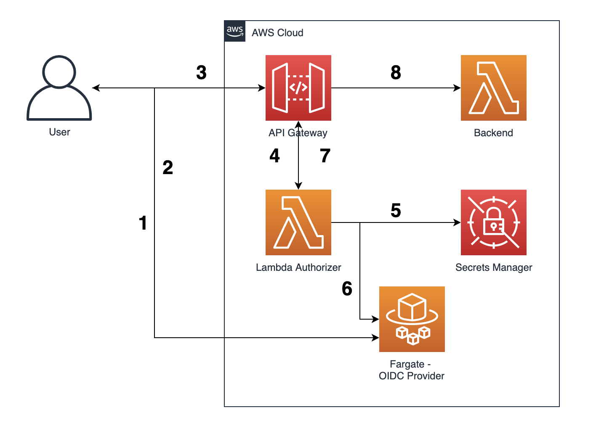
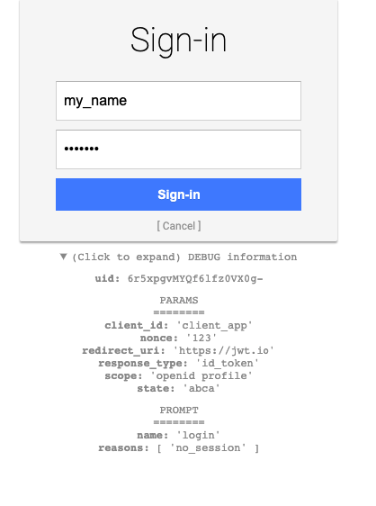
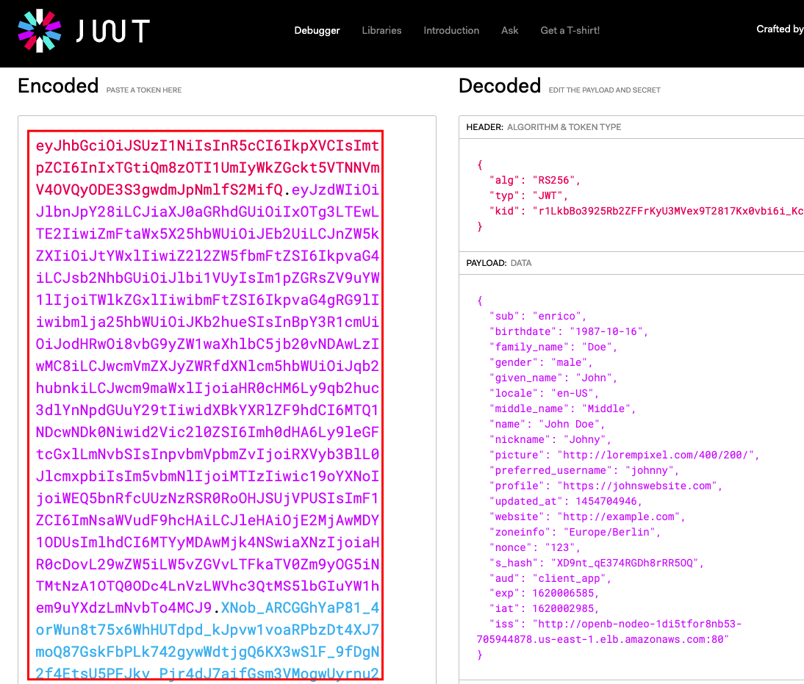

# Open Banking Brazil - Authentication Samples

## Overview

This repo intends to demonstrate how to address the OAuth2-based authorization security requirement for Brazilian Open Banking to use Amazon API Gateway to protect and authorize API accesses using an external [FAPI-compliant OIDC provider](./resources/oidc-provider-app) and a [Lambda Authorizer](./resources/lambda/lambda-auth.js).
*** 

## Prerequisites:

- [awscli](https://docs.aws.amazon.com/cli/latest/userguide/cli-chap-install.html)
- [Pre configured AWS credentials](https://docs.aws.amazon.com/amazonswf/latest/developerguide/RubyFlowOptions.html)
- [npm](https://docs.npmjs.com/downloading-and-installing-node-js-and-npm)
- [cdk](https://docs.aws.amazon.com/cdk/latest/guide/getting_started.html)
- [Docker](https://docs.docker.com/get-docker/)
- [A Route 53 Public Hosted Zone configured to a DNS](https://docs.aws.amazon.com/Route53/latest/DeveloperGuide/dns-configuring.html)
- [A Public Certificate issued to your Domain Name using ACM](https://docs.aws.amazon.com/acm/latest/userguide/gs-acm-request-public.html)

## 1. How to deploy

### 1.1. Creating the Container Image

Make sure Docker is running. We will use Docker to create the container that will be used to run NODE-OIDC, create an Amazon ECR repository, and push our newly create image to our repository. 

After Docker is running, execute the following commands: 

```sh
git clone <REPO_URL>
cd <REPO_NAME>/resources/oidc-provider-app
npm install
aws ecr create-repository --repository-name oidc-provider-app
```

Take note of your `repositoryUrl` output variable, which should be something like this: `repositoryUri": "<AWS_ACCOUNT_ID>.dkr.ecr.<AWS_REGION>.amazonaws.com/oidc-provider-app"`

Now let's build our image and push it to the ECR repository:

```sh
docker build -t oidc-provider-app .
docker tag oidc-provider-app:latest <AWS_ACCOUNT_ID>.dkr.ecr.<AWS_REGION>.amazonaws.com/oidc-provider-app:latest
docker push <AWS_ACCOUNT_ID>.dkr.ecr.<AWS_REGION>.amazonaws.com/oidc-provider-app:latest
```

### 1.2. Configure Environment Variables

Now, make sure to set the following env variables in the `.env` file:

| Key   |      Value      |      Description      |
|----------|:-------------:|-----------------------:|
| ECR_REPOSITORY_ARN | arn:aws:ecr:<region>:<account_id>:repository/oidc-provider-app | Your Amazon ECR repository name for the Node OIDC Provider application |
| ECR_OIDC_IMAGE_TAG | latest | Your Docker image tag (e.g. latest) |
| ACM_CERTIFICATE_ARN |  arn:aws:acm:<region>:<account_id>:certificate/abc-123 | Your Amazon Certificate Manager (ACM) public certificate ARN |
| R53_ZONE_NAME | example.com | Your Route 53 public zone name (e.g. example.com) |
| R53_HOSTED_ZONE_ID | ABCDEF012345 | Your Route 53 public Hosted Zone ID |
| R53_DOMAIN_NAME | oidc.example.com | The desired domain name to host your OIDC application (e.g. oidc.example.com) |
| JWKS_URI | /jwks | Your OIDC Provider's JWKS Endpoint |
| SM_JWKS_SECRET_NAME | dev/OpenBankingBrazil/Auth/OIDC_JWKS | The AWS Secrets Manager's secret name to securely store your JWKS Key ID for JWT token verification |

### 1.3. Deploy the CDK Stack

```sh
cd <REPO_NAME>/resources/lambda
npm install
cd ../..
npm install
cdk deploy
```

This will install all packages required. CDK will then bootstrap a deploy environment in your account. You will then synthetize a cloudformation template and finally deploy it. The end result will be the following architecture: 




## 2. Test Your Application 

### 2.1. Terminal - Invoke your API
First, use terminal to run the following command to invoke your API without any JWT token:

```sh
curl -X GET https://<API-ID>.execute-api.<REGION>.amazonaws.com/prod/
```
You should get the following error message with a `401 HTTP Status Code`:

`"message": "Unauthorized"`

Or the following error message with a `403 HTTP Status Code` in case you pass an invalid `Bearer` token:

`"Message": "User is not authorized to access this resource with an explicit deny"`

### 2.2. Browser - Authenticate against the OIDC provider

Open your browser and open the following URL:

`https://<YOUR-DOMAIN-NAME>/auth?client_id=client_app&redirect_uri=https://jwt.io&response_type=id_token&scope=openid%20profile&nonce=123&state=abca`

You'll be required to enter your username/password. At this time, you can enter any user/pass. Click **Sign-in**.



Now, once presented with the `consent` screen, you can authorize the provider to issue a token on behalf of your user. Click **Continue**.


For validation-only purposes, you are being redirected to JWT.IO to visualize your issue JWT token. **Copy the generated token from the left side of the screen**.



### 2.3. Terminal - Invoke your API passing your JWT as Authorization Header

Let's try once again, this time including the `Authorization` header in our request together with our newly issued JWT token.

```sh
curl -X GET https://<API-ID>.execute-api.<REGION>.amazonaws.com/prod/ -H "Authorization: Bearer <YOUR.ACCESS.TOKEN>"
```

Now, you should get the following message with a `200 HTTP Status Code`:

`Hello From Authorized API`

Congratulations! You have now configured your API Gateway to authorize access based on JWT-based tokens issued by an external FAPI-compliant OIDC Provider.

## 3. Cleaning UP

Run the following command:

```sh
cdk destroy
aws ecr delete-repository --repository-name oidc-provider-app
```

## 4. Security

See [CONTRIBUTING](CONTRIBUTING.md#security-issue-notifications) for more information.

## 5. License

This library is licensed under the MIT-0 License. See the LICENSE file.


